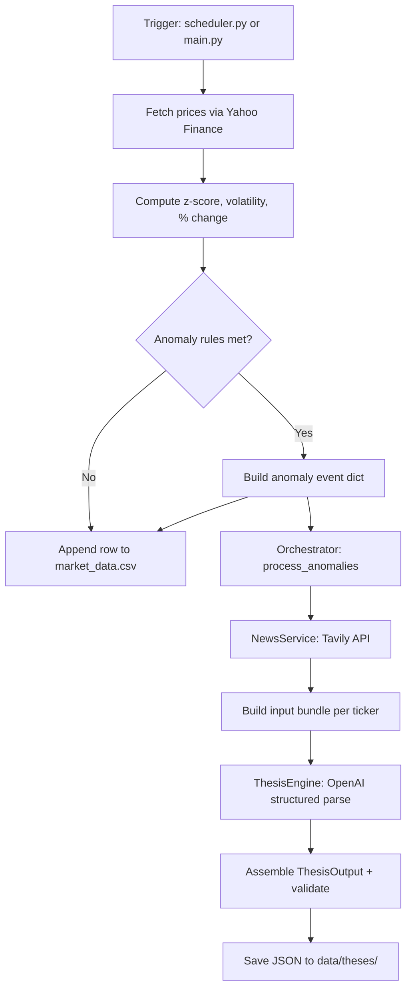

***This document describes the current implementation and may lag behind the code. For authoritative behavior, consult the source files referenced below.***

---

# Investment Advisor Agent — End-to-End Workflow Walkthrough

**Audience:** Analysts, portfolio managers, and technical stakeholders  
**Purpose:** Trace how a price anomaly becomes a structured investment thesis JSON  
**Worked example:** `data/theses/AAPL_2026-06-09T13-30-00.json`

---

## 1. What this system does (in one paragraph)

The system watches a fixed list of tickers during US market hours, detects statistically unusual price moves, fetches related news, and asks an LLM to produce a **structured analyst-style thesis** for each event. Every thesis is saved as a JSON file under `data/theses/` with status `pending_review`. **Nothing trades automatically** — the output is meant for human review.

---

## 2. High-level pipeline



---

## 3. How the workflow is triggered

There are **two entry points**. Both end in the same thesis pipeline, but they differ in scheduling and backlog handling.

### 3A. Automated — `scheduler.py` (production-style)

| What | Detail |
|------|--------|
| **When** | Every hour, Mon–Fri, 9:00–15:59 US/Eastern |
| **Entry function** | `job()` in `scheduler.py` |
| **What it calls** | `get_market_data_and_detect_anomalies()` → `process_anomalies(flagged)` |
| **Backlog** | Does **not** scan CSV for missed anomalies |

**Follow the code:**

1. Open `scheduler.py`
2. Read `job()` (lines 12–32) — market-hours and weekday guards
3. Line 26: `results, flagged = get_market_data_and_detect_anomalies()`
4. Lines 28–29: if anomalies exist, `process_anomalies(flagged)` runs immediately

### 3B. Manual / catch-up — `main.py`

| What | Detail |
|------|--------|
| **When** | You run `python main.py` |
| **Entry function** | `if __name__ == "__main__"` block |
| **Extra capability** | Picks up **CSV backlog** — flagged rows that never got a thesis file |

**Follow the code:**

1. Open `main.py`
2. Step 1 (line 7): `run_pipeline()` → thin wrapper in `services/pipeline.py` → same market-data function as the scheduler
3. Step 2 (lines 10–11): `get_unprocessed_anomalies_from_csv()` + `merge_anomalies()` — deduplicates live + backlog
4. Step 3 (line 19): `process_anomalies(to_process)`

**Key difference:** `main.py` is the safer choice if a prior run flagged an anomaly but thesis generation failed (API error, rate limit, etc.).

---

## 4. Stage 1 — Market data and anomaly detection

### File map

| File | Role |
|------|------|
| `services/market_data.py` | Fetch prices, compute metrics, persist CSV, backlog scan |
| `services/anomaly_detector.py` | Pure math: z-score, volatility, anomaly rule |
| `services/pipeline.py` | One-line wrapper used by `main.py` |
| `data/market_data.csv` | Append-only history of every run |

### Step-by-step: follow `get_market_data_and_detect_anomalies()`

**Start here:** `services/market_data.py`, function `get_market_data_and_detect_anomalies()` (line 146)

For each ticker in `WATCHLIST` (`AAPL`, `TSLA`, `MSFT`, `GOOGL`, `NVDA`, `AMZN`, `^GSPC`):

1. **`fetch_price_history(ticker)`** (line 42)  
   - Calls Yahoo Finance via `yfinance`  
   - Tries several period/interval combinations if the first request is empty

2. **Compute metrics** (lines 168–178)  
   - `market_timestamp` = timestamp of the latest price bar  
   - `pct_change` = % move from first bar open to last bar close in the fetched window  
   - `z_score` = `compute_zscore(prices)`  
   - `volatility` = `compute_volatility(prices)`

3. **Anomaly decision** (line 180)  
   - `detect_anomaly(z_score, pct_change, volatility)` in `services/anomaly_detector.py`

### Anomaly rule (deterministic, no AI)

```18:22:services/anomaly_detector.py
def detect_anomaly(z_score, pct_change, volatility):
    return (
        z_score < -2
        and abs(pct_change) > (2 * volatility)
    )
```

Both conditions must be true:
- Price is **more than 2 standard deviations below** recent history (`z < -2`)
- The **absolute % move** exceeds **2× recent volatility**

> Note: Only **downside** anomalies trigger today (`z < -2`, not `|z| > 2`).

4. **If flagged**, append to in-memory `flagged` list (lines 182–192):

```python
{
    "ticker": "AAPL",
    "market_timestamp": "2026-06-09 13:30:00",
    "detected_at": "<when pipeline ran>",
    "price": 289.75,
    "z_score": -2.32,
    "pct_change": -7.77,
    "volatility": 1.49,
    "source": "live_detection"   # or "csv_backlog" from main.py
}
```

5. **Always** append a row to `data/market_data.csv` (lines 194–204), including `anomaly_flag: True/False`.

---

## 5. Worked example — how AAPL became an anomaly

**Thesis file:** `data/theses/AAPL_2026-06-09T13-30-00.json`  
**Matching CSV row:** `data/market_data.csv`, line 233:

```
2026-06-09 13:30:00,AAPL,289.75,-7.77,-2.32,True
```

| Field | Value | Meaning |
|-------|-------|---------|
| `market_timestamp` | `2026-06-09 13:30:00` | When the price bar occurred |
| `price` | 289.75 | Last close in fetched window |
| `pct_change` | -7.77% | Sharp drawdown vs window open |
| `z_score` | -2.32 | More than 2σ below recent mean → passes rule 1 |
| `volatility` | ~1.49% | Rule 2: \|−7.77\| > 2×1.49 ≈ 2.98 ✓ |
| `anomaly_flag` | `True` | Persisted to CSV |

The thesis JSON `event` block is a direct copy of these facts, plus `direction: "down"` (derived in the orchestrator).

**Filename mapping:**  
`market_timestamp` `2026-06-09 13:30:00` → file `AAPL_2026-06-09T13-30-00.json`  
(spaces → `T`, colons → `-` for filesystem safety — see `make_event_filename()` in `services/orchestrator.py`)

---

## 6. Stage 2 — Orchestration (anomaly → thesis file)

**Start here:** `services/orchestrator.py`, function `process_anomalies()` (line 120)

This is the **central coordinator**. It owns sequencing, deduplication, news fetch, LLM call, and file write.

### Processing order

1. Sort anomalies by `(market_timestamp, ticker)` — earliest first
2. For each anomaly, **one ticker at a time** (sequential, not parallel)
3. **Dedup:** if `data/theses/<ticker>_<timestamp>.json` already exists → skip
4. **2-second pause** between tickers (rate-limit protection)

### Per-anomaly sub-steps inside the loop

| Step | Function | File | What happens |
|------|----------|------|--------------|
| 1 | `news_service.get_news(anomaly)` | `services/news_service.py` | Tavily search for ticker |
| 2 | `build_input_bundle(anomaly, news)` | `services/orchestrator.py` | Combine price + news + instructions |
| 3 | `thesis_engine.generate(input_bundle)` | `services/thesis_engine.py` | One LLM call, structured JSON |
| 4 | Assemble `ThesisOutput(...)` | `schemas/thesis_output.py` | Add IDs, timestamps, sources, metadata |
| 5 | `save_thesis(thesis, path)` | `services/orchestrator.py` | Write `data/theses/*.json` |

If one ticker fails (API error), the loop **logs and continues** with the next ticker.

---

## 7. Stage 3 — News retrieval

**File:** `services/news_service.py`  
**Class:** `NewsService`

**Input:** the anomaly dict (needs `ticker`, `market_timestamp`)

**What it does:**
- POST to Tavily `https://api.tavily.com/search`
- Query = ticker symbol (e.g. `"AAPL"`)
- Returns up to 10 articles with title, URL, content snippet, published date

**Output shape:**

```python
{
    "ticker": "AAPL",
    "move_time": "2026-06-09 13:30:00",      # preserved for causal alignment
    "retrieved_at": "2026-06-09T18:13:44.893722",
    "article_count": 10,
    "articles": [ ... ]
}
```

**Design note for analysts:** News is **relevance-based**, not strictly time-filtered to the minute of the move. The LLM is instructed to judge whether articles **plausibly explain** the timing and magnitude of the move.

**Requires:** `TAVILY_API_KEY` in environment / `.env`

---

## 8. Stage 4 — Thesis generation (LLM reasoning layer)

### Prompt

**File:** `prompts/thesis_generation.txt`  
**Version tag:** `thesis_generation_v1` (hardcoded in `services/thesis_engine.py`)

The prompt defines three analyst categories:
- **Scare** — temporary overreaction; may mean-revert
- **Fundamental** — structural repricing; don't assume bounce
- **Inconclusive** — news doesn't explain the move

### Engine

**File:** `services/thesis_engine.py`  
**Class:** `ThesisEngine`

1. Loads prompt template from disk
2. Receives `input_bundle` JSON from orchestrator (anomaly metrics + truncated articles + analysis instructions)
3. Calls OpenAI with **structured parsing** — response must match `ThesisAnalysis` schema
4. Returns validated Pydantic object (not raw text)

**Requires:** `OPENAI_API_KEY` (optional `OPENAI_MODEL`, default `gpt-4.1-mini`)

### What the LLM returns vs what gets saved

| LLM returns (`ThesisAnalysis`) | Orchestrator adds (`ThesisOutput`) |
|-------------------------------|-------------------------------------|
| `classification` | `thesis_id`, `version`, `status` |
| `analysis` | `created_at` (UTC) |
| `recovery_view` | Full `event` block from anomaly |
| `investment_view` | `sources` (article audit trail) |
| | `metadata` (model, prompt version) |

The LLM does **not** set IDs or timestamps — the orchestrator does, for auditability.

---

## 9. Stage 5 — Output schema and saved thesis

**Schema file:** `schemas/thesis_output.py`

### Top-level document (`ThesisOutput`)

| Section | Business meaning |
|---------|------------------|
| `thesis_id` | Unique key: `{ticker}_{market_timestamp}` |
| `status` | Always `pending_review` in v1 |
| `event` | Ground-truth price statistics |
| `classification` | Scare / Fundamental / Inconclusive + confidence |
| `analysis` | Likely causes + news causality strength |
| `recovery_view` | Expected reversion (no price targets) |
| `investment_view` | Drivers, risks, recommended stance |
| `sources` | Which articles were available |
| `metadata` | Model and prompt version for reproducibility |

### AAPL example — how to read the output

Open `data/theses/AAPL_2026-06-09T13-30-00.json` and read top to bottom:

1. **`event`** — The -7.77% move at 13:30 on 2026-06-09; z-score -2.32 confirms statistical extremity.

2. **`classification`** — `scare_situation` / `simple_scare` at 0.8 confidence. Summary ties the drop to WWDC/AI sentiment, not fundamental deterioration.

3. **`analysis`** — Three likely causes; `news_causal_assessment: "moderate"` — news timing is plausible but not airtight.

4. **`recovery_view`** — `partial_reversion` — expects some bounce, not guaranteed return to prior highs.

5. **`investment_view`** — `recommended_stance: "monitor"` — no trade signal; watch for follow-up news.

6. **`sources`** — 10 Tavily articles (WWDC previews, Citi note, sector volatility). Full audit trail for human review.

7. **`metadata`** — Produced by `gpt-4.1-mini` with prompt `thesis_generation_v1`.

---

## 10. Complete function call chain (quick reference)

### Scheduler path

```
scheduler.py :: job()
  └─ services/market_data.py :: get_market_data_and_detect_anomalies()
       ├─ fetch_price_history()          [per ticker]
       ├─ services/anomaly_detector.py :: compute_zscore()
       ├─ services/anomaly_detector.py :: compute_volatility()
       ├─ services/anomaly_detector.py :: detect_anomaly()
       └─ append_data() → data/market_data.csv
  └─ services/orchestrator.py :: process_anomalies(flagged)
       ├─ thesis_path() / dedup check
       ├─ services/news_service.py :: NewsService.get_news()
       ├─ build_input_bundle()
       ├─ services/thesis_engine.py :: ThesisEngine.generate()
       ├─ ThesisOutput(...) assembly
       └─ save_thesis() → data/theses/*.json
```

### Manual path (`main.py`) — adds backlog

```
main.py
  └─ services/pipeline.py :: run_pipeline()
       └─ get_market_data_and_detect_anomalies()   [same as above]
  └─ services/market_data.py :: get_unprocessed_anomalies_from_csv()
  └─ services/orchestrator.py :: merge_anomalies(flagged, backlog)
  └─ process_anomalies(to_process)                [same as above]
```

---

## 11. Data artifacts produced along the way

| Artifact | Location | When written | Purpose |
|----------|----------|--------------|---------|
| Price snapshot row | `data/market_data.csv` | Every pipeline run | Historical metrics + `anomaly_flag` |
| Thesis document | `data/theses/<TICKER>_<TS>.json` | Only when anomaly processed | Analyst-ready structured output |

**Dedup rule:** One thesis per `(ticker, market_timestamp)`. Re-running the pipeline will not overwrite an existing thesis file.

---

## 12. What is NOT implemented yet

For manager expectations — the pipeline **stops at thesis JSON**:

| Capability | Status |
|------------|--------|
| Human review UI / approval workflow | Not built |
| Holding creation or position tracking | Not built |
| Thesis versioning / re-evaluation over time | Not built |
| Upside anomalies (`z > +2`) | Not detected today |
| Autonomous trading | Explicitly out of scope |

Every thesis ships with `"status": "pending_review"`.

---

## 13. Suggested reading order for a new analyst

Read in this sequence to follow one AAPL event end-to-end:

1. `scheduler.py` or `main.py` — how a run starts  
2. `services/market_data.py` → `get_market_data_and_detect_anomalies()`  
3. `services/anomaly_detector.py` — understand the trigger rule  
4. `data/market_data.csv` line 233 — raw flagged row for AAPL  
5. `services/orchestrator.py` → `process_anomalies()`  
6. `services/news_service.py` — what context the LLM sees  
7. `prompts/thesis_generation.txt` — analyst instructions given to the model  
8. `services/thesis_engine.py` — how the LLM is called  
9. `schemas/thesis_output.py` — field definitions  
10. `data/theses/AAPL_2026-06-09T13-30-00.json` — final deliverable  

---

## 14. Environment requirements

| Variable | Used by | Purpose |
|----------|---------|---------|
| `TAVILY_API_KEY` | `NewsService` | Financial news search |
| `OPENAI_API_KEY` | `ThesisEngine` | Thesis generation |
| `OPENAI_MODEL` | `ThesisEngine` | Optional; defaults to `gpt-4.1-mini` |

---

## 15. Glossary

| Term | Definition |
|------|------------|
| **Anomaly event** | A price move passing deterministic statistical rules |
| **Market timestamp** | When the price bar occurred (anchor for the event) |
| **Detected at** | When our pipeline observed/recorded it |
| **Input bundle** | JSON payload sent to the LLM (metrics + news + instructions) |
| **Thesis** | Structured JSON analyst output, not a trade order |
| **Backlog** | CSV-flagged anomalies missing a corresponding thesis file |

---

*Document version: reflects codebase as of June 2026. Suggested save path: `docs/workflow_walkthrough.md`.*

---

I'm in **Ask mode**, so I can't create the file in your repo. To save it:

1. Copy everything above (from the `# Investment Advisor Agent` heading through the footer), or  
2. Switch to **Agent mode** and ask me to write it to `docs/workflow_walkthrough.md`.

I can also produce a shorter one-page executive summary or a version with a sequence diagram per function if you want that next.